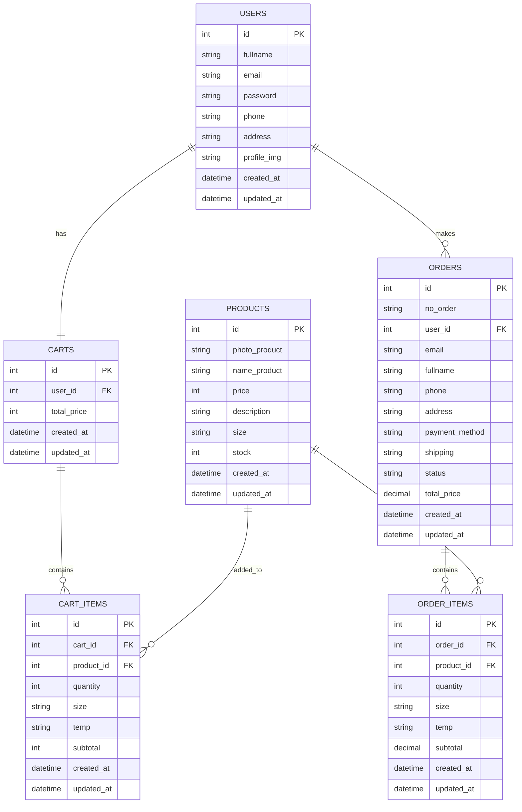

```mermaid
erDiagram

    USERS {
        int id PK
        string fullname
        string email
        string password
        string phone
        string address
        string profile_img
        datetime created_at
        datetime updated_at
    }

    PRODUCTS {
        int id PK
        string photo_product
        string name_product
        int price
        string description
        string size
        int stock
        datetime created_at
        datetime updated_at
    }

    CARTS {
        int id PK
        int user_id FK
        int total_price
        datetime created_at
        datetime updated_at
    }

    CART_ITEMS {
        int id PK
        int cart_id FK
        int product_id FK
        int quantity
        string size
        string temp
        int subtotal
        datetime created_at
        datetime updated_at
    }

    ORDERS {
        int id PK
        string no_order
        int user_id FK
        string email
        string fullname
        string phone
        string address
        string payment_method
        string shipping
        string status
        decimal total_price
        datetime created_at
        datetime updated_at
    }

    ORDER_ITEMS {
        int id PK
        int order_id FK
        int product_id FK
        int quantity
        string size
        string temp
        decimal subtotal
        datetime created_at
        datetime updated_at
    }

    USERS ||--|| CARTS : has
    CARTS ||--o{ CART_ITEMS : contains
    PRODUCTS ||--o{ CART_ITEMS : added_to

    USERS ||--o{ ORDERS : makes
    ORDERS ||--o{ ORDER_ITEMS : contains
    PRODUCTS ||--o{ ORDER_ITEMS : ordered_in
```