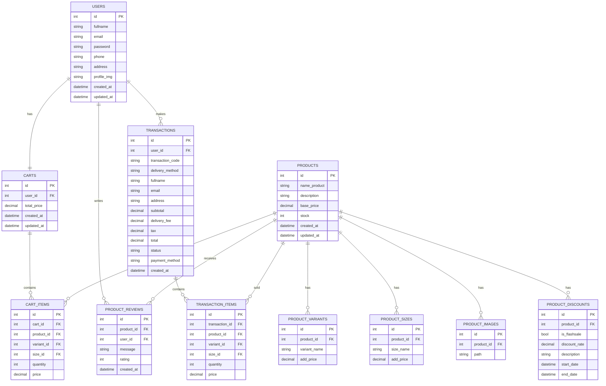

```mermaid
erDiagram

    USERS {
        int id PK
        string fullname
        string email
        string password
        string phone
        string address
        string profile_img
        datetime created_at
        datetime updated_at
    }

    PRODUCTS {
        int id PK
        string name_product
        string description
        decimal base_price
        int stock
        datetime created_at
        datetime updated_at
    }

    PRODUCT_VARIANTS {
        int id PK
        int product_id FK
        string variant_name
        decimal add_price
    }

    PRODUCT_SIZES {
        int id PK
        int product_id FK
        string size_name
        decimal add_price
    }

    PRODUCT_IMAGES {
        int id PK
        int product_id FK
        string path
    }

    PRODUCT_DISCOUNTS {
        int id PK
        int product_id FK
        bool is_flashsale
        decimal discount_rate
        string description
        datetime start_date
        datetime end_date
    }

    PRODUCT_REVIEWS {
        int id PK
        int product_id FK
        int user_id FK
        string message
        int rating
        datetime created_at
    }

    CARTS {
        int id PK
        int user_id FK
        decimal total_price
        datetime created_at
        datetime updated_at
    }

    CART_ITEMS {
        int id PK
        int cart_id FK
        int product_id FK
        int variant_id FK
        int size_id FK
        int quantity
        decimal price
    }

    TRANSACTIONS {
        int id PK
        int user_id FK
        string transaction_code
        string delivery_method
        string fullname
        string email
        string address
        decimal subtotal
        decimal delivery_fee
        decimal tax
        decimal total
        string status
        string payment_method
        datetime created_at
    }

    TRANSACTION_ITEMS {
        int id PK
        int transaction_id FK
        int product_id FK
        int variant_id FK
        int size_id FK
        int quantity
        decimal price
    }

    USERS ||--|| CARTS : has
    USERS ||--o{ PRODUCT_REVIEWS : writes
    USERS ||--o{ TRANSACTIONS : makes

    PRODUCTS ||--o{ PRODUCT_VARIANTS : has
    PRODUCTS ||--o{ PRODUCT_SIZES : has
    PRODUCTS ||--o{ PRODUCT_IMAGES : has
    PRODUCTS ||--o{ PRODUCT_DISCOUNTS : has
    PRODUCTS ||--o{ PRODUCT_REVIEWS : receives

    CARTS ||--o{ CART_ITEMS : contains
    PRODUCTS ||--o{ CART_ITEMS : added

    TRANSACTIONS ||--o{ TRANSACTION_ITEMS : contains
    PRODUCTS ||--o{ TRANSACTION_ITEMS : sold

```
